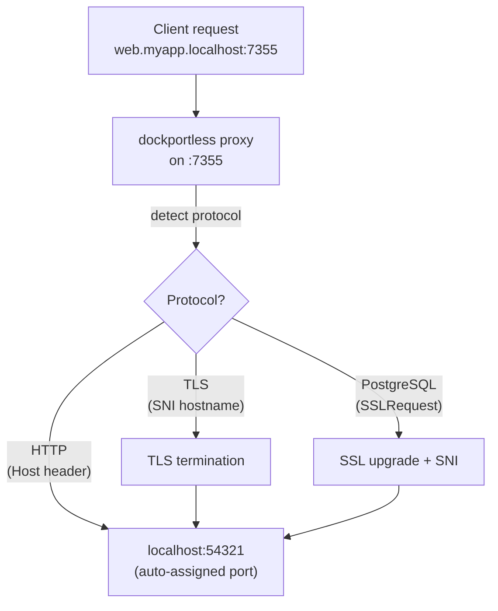

# dockportless

**Local service router with automatic port assignment, like [vercel/portless](https://github.com/vercel-labs/portless) but for any compose-compatible tool.**

No more port conflicts. No more remembering port numbers. Just `<service>.<project>.localhost`.

## Overview

dockportless wraps any compose-compatible command (like `docker compose up`) and automatically:

1. Parses your `compose.yml` to discover services
2. Assigns an available port to each service
3. Sets `<SERVICE_NAME>_PORT` environment variables
4. Starts a reverse proxy so you can access services via `<service>.<project>.localhost:7355`

Inspired by [vercel/portless](https://github.com/vercel-labs/portless) — the same pretty-URL experience, brought to your local Docker Compose workflow.

## Features

- **Zero-config port management** — Automatically assigns available ports, no collisions
- **Pretty local URLs** — Access services at `web.myapp.localhost:7355` instead of `localhost:49152`
- **TLS SNI routing** — Automatic protocol detection for HTTP, HTTPS, and PostgreSQL SSL with TLS termination
- **Multi-port support** — Services exposing multiple ports get indexed URLs (`0.web.myapp.localhost`, `1.web.myapp.localhost`)
- **Parallel worktree support** — Develop multiple features simultaneously across git worktrees without port conflicts
- **Agent-friendly** — Includes an [Agent Skill](#agent-skill) for AI coding agents to automate dev environment setup
- **Single binary** — Built in Zig, no runtime dependencies
- **Compose-compatible** — Works with `docker compose`, `podman-compose`, `nerdctl` or any compose-spec tool

## Quick Start

Given a `compose.yml`:

```yaml
services:
  web:
    image: nginx:alpine
    ports:
      - "${WEB_PORT:-8080}:80"
```

Run it with dockportless:

```bash
dockportless run myapp docker compose up
```

Access your service at: **http://web.myapp.localhost:7355**

> [!TIP]
> Your compose file still works without dockportless — `docker compose up` will use the default port (`8080` in this example).

## Installation

### Homebrew

```bash
brew install mazrean/tap/dockportless
```

### apt (Debian / Ubuntu)

```bash
# Download the .deb from the latest release
curl -LO https://github.com/mazrean/dockportless/releases/latest/download/dockportless_amd64.deb
sudo dpkg -i dockportless_amd64.deb
```

### yum / dnf (Fedora / RHEL)

```bash
# Download the .rpm from the latest release
curl -LO https://github.com/mazrean/dockportless/releases/latest/download/dockportless_amd64.rpm
sudo rpm -i dockportless_amd64.rpm
```

### apk (Alpine)

```bash
# Download the .apk from the latest release
curl -LO https://github.com/mazrean/dockportless/releases/latest/download/dockportless_amd64.apk
sudo apk add --allow-untrusted dockportless_amd64.apk
```

### From releases

Download the latest binary from [GitHub Releases](https://github.com/mazrean/dockportless/releases).

### Build from source

Requires [Zig 0.15+](https://ziglang.org/download/):

```bash
zig build -Doptimize=ReleaseSafe
```

## Usage

### `dockportless run`

Wraps a command with auto-assigned ports and starts the proxy.

```bash
dockportless run <project_name> <command...>
```

**Examples:**

```bash
# Basic usage
dockportless run myapp docker compose up

# With a custom compose file
dockportless run myapp docker compose -f compose.dev.yml up

# With podman
dockportless run myapp podman-compose up
```

Each service in your compose file gets a `<SERVICE_NAME>_PORT` environment variable. Use them in your compose file:

```yaml
services:
  web:
    image: nginx:alpine
    ports:
      - "${WEB_PORT:-3000}:80"
  api:
    image: node:22-alpine
    ports:
      - "${API_PORT:-5678}:5678"
```

Access them at:
- `http://web.myapp.localhost:7355`
- `http://api.myapp.localhost:7355`

### `dockportless proxy`

Starts only the proxy server. This is only needed when the proxy process is restarted while `dockportless run` is still running — for example, after a crash or manual restart. Under normal usage, `dockportless run` starts the proxy automatically.

```bash
dockportless proxy
```

### `dockportless trust`

Installs the dockportless CA certificate into your system trust store. Required for TLS SNI routing (HTTPS and PostgreSQL SSL). Needs elevated privileges.

```bash
sudo dockportless trust
```

Supported trust stores:
- **Linux**: Debian/Ubuntu, RHEL/Fedora, Arch Linux, SUSE
- **macOS**: System Keychain

## TLS SNI Routing

dockportless automatically detects the protocol of incoming connections and routes them accordingly:

- **HTTP** — Routed by `Host` header
- **TLS (HTTPS)** — Routed by SNI hostname with TLS termination
- **PostgreSQL SSL** — Detects `SSLRequest`, upgrades to TLS, then routes by SNI

To use TLS routing, first install the CA certificate:

```bash
sudo dockportless trust
```

Then access your services over HTTPS:

```
https://web.myapp.localhost:7355
```

For PostgreSQL SSL connections:

```bash
psql "host=db.myapp.localhost port=7355 sslmode=require"
```

## Multi-Port Services

When a service exposes multiple ports, dockportless assigns indexed environment variables and URLs:

```yaml
services:
  web:
    image: myapp
    ports:
      - "${WEB_PORT_0:-8080}:8080"   # HTTP
      - "${WEB_PORT_1:-8443}:8443"   # HTTPS
```

Access each port via its index prefix:

- `http://web.myapp.localhost:7355` → port index 0 (no prefix needed)
- `http://1.web.myapp.localhost:7355` → port index 1

> [!NOTE]
> `WEB_PORT` is an alias for `WEB_PORT_0`. For single-port services, everything works the same as before.

## Parallel Development with Git Worktrees

dockportless is designed for developing multiple features in parallel using [git worktrees](https://git-scm.com/docs/git-worktree). Each worktree gets its own project name, ports, and proxy routes — no collisions, no coordination needed.

```bash
# Main worktree
cd ~/myapp && dockportless run myapp docker compose up

# Feature branch worktree
cd ~/myapp-feat-login && dockportless run myapp-feat-login docker compose up

# Another feature branch
cd ~/myapp-fix-auth && dockportless run myapp-fix-auth docker compose up
```

All services are accessible through the same port, namespaced by project:
- `http://web.myapp.localhost:7355`
- `http://web.myapp-feat-login.localhost:7355`
- `http://api.myapp-fix-auth.localhost:7355`

> [!NOTE]
> Multiple dockportless processes share port 7355 seamlessly. Any process can route to any project's services.

## How It Works



## Examples

See the [`examples/`](examples/) directory:

| Example | Description |
|---------|-------------|
| [simple-web](examples/simple-web/) | Single nginx service |
| [multi-service](examples/multi-service/) | Web + API + DB |
| [multi-port](examples/multi-port/) | Single service with multiple ports |
| [multi-project](examples/multi-project/) | Parallel worktrees simulated with separate project names |
| [custom-compose-file](examples/custom-compose-file/) | Using `-f` flag with different compose files |
| [tls-sni](examples/tls-sni/) | HTTPS routing with TLS SNI termination |
| [postgres-ssl](examples/postgres-ssl/) | PostgreSQL SSL routing |

## Agent Skill

dockportless includes an [Agent Skill](skills/verifying-dockportless/) for AI coding agents like [Claude Code](https://claude.com/claude-code). The skill enables agents to:

- **Derive worktree-unique project names** automatically from the git worktree path
- **Launch and verify** dev environments without manual intervention
- **Develop across multiple worktrees** in parallel — each agent session gets isolated ports and routes

This makes dockportless ideal for agent-driven workflows where multiple features are developed concurrently in separate worktrees.

### Install via [`skills`](https://github.com/vercel-labs/skills) CLI

```bash
npx skills add mazrean/dockportless --skill verifying-dockportless
```

Or manually copy the [`skills/verifying-dockportless/`](skills/verifying-dockportless/) directory into your project's or user's skill directory.

## Supported Platforms

| Platform | Architecture |
|----------|-------------|
| Linux | x86_64, aarch64 |
| macOS | x86_64, aarch64 |
